# github-readme-stats-worker

Self-hosted GitHub readme stats cards on Cloudflare Workers. Ported from [anuraghazra/github-readme-stats](https://github.com/anuraghazra/github-readme-stats) @ [`5df91f9`](https://github.com/anuraghazra/github-readme-stats/commit/5df91f9bfa89c356a55cbb3c2bbc164fdbf94a86).

No cold starts. No shared rate limits. Your own GitHub stats on your own infrastructure.

## Preview

<p align="center">
  
  <br />
  
  <br />
  
  <br />
  
</p>

<details>
<summary>More theme examples</summary>
<br />
<p align="center">
  
  <br />
  
  <br />
  
</p>
</details>

## Why self-host?

The public `github-readme-stats.vercel.app` instance is shared by thousands of users and frequently hits GitHub API rate limits, resulting in broken images on your profile. Self-hosting gives you:

- **Reliability** — your own PAT, your own rate limits
- **Speed** — Cloudflare Workers run at the edge, no cold starts
- **Control** — pin to a known upstream version, update on your schedule
- **Privacy** — API tokens stay in your own Cloudflare account

## Routes

| Route                        | Card                |
| ---------------------------- | ------------------- |
| `/api?username=X`            | GitHub stats        |
| `/api/top-langs?username=X`  | Most used languages |
| `/api/pin?username=X&repo=Y` | Repo pin card       |
| `/api/streak?username=X`     | Contribution streak |
| `/health`                    | JSON health check   |

## Quick start

### Prerequisites

- [Node.js](https://nodejs.org/) 18+
- A [GitHub Personal Access Token](https://github.com/settings/tokens) with `read:user` scope (add `repo` for private repo stats)
- A [Cloudflare account](https://dash.cloudflare.com/) (free tier works)

### Local development

```sh
git clone https://github.com/lukecartledge/github-readme-stats-worker.git
cd github-readme-stats-worker
npm install

# Create your local secrets file
cp .dev.vars.example .dev.vars
# Edit .dev.vars and add your GitHub PAT:
#   GH_PAT_1=ghp_your_token_here

npm run dev
# → http://localhost:8787/api?username=YOUR_USERNAME
```

### Deploy to Cloudflare

1. **Create a Cloudflare API token** at [dash.cloudflare.com/profile/api-tokens](https://dash.cloudflare.com/profile/api-tokens) with the `Edit Cloudflare Workers` template.

2. **Add secrets:**

   ```sh
   # GitHub PAT for API access
   npx wrangler secret put GH_PAT_1

   # Optional: additional PATs for rate limit rotation
   npx wrangler secret put GH_PAT_2
   ```

3. **Deploy:**

   ```sh
   npm run deploy
   ```

   Or push to `main` — GitHub Actions auto-deploys via the included workflow.

4. **(Optional) Custom domain:**

   Add a custom domain (e.g. `stats.yourdomain.com`) in the Cloudflare dashboard under Workers & Pages → your worker → Settings → Domains & Routes.

### Use in your GitHub profile README

```markdown


[](https://github.com/YOUR_USERNAME/YOUR_REPO)
```

## Stats card options

| Parameter             | Type    | Default      | Description                                                                                                                    |
| --------------------- | ------- | ------------ | ------------------------------------------------------------------------------------------------------------------------------ |
| `username`            | string  | **required** | GitHub username                                                                                                                |
| `theme`               | string  | `default`    | Card theme (see [themes](#themes))                                                                                             |
| `hide`                | string  | —            | Comma-separated stats to hide (`stars`, `commits`, `prs`, `issues`, `contribs`)                                                |
| `show`                | string  | —            | Additional stats to show (`prs_merged`, `prs_merged_percentage`, `discussions_started`, `discussions_answered`)                |
| `show_icons`          | boolean | `false`      | Show icons next to stats                                                                                                       |
| `hide_title`          | boolean | `false`      | Hide the card title                                                                                                            |
| `hide_border`         | boolean | `false`      | Hide the card border                                                                                                           |
| `hide_rank`           | boolean | `false`      | Hide the rank circle                                                                                                           |
| `include_all_commits` | boolean | `false`      | Count all commits (not just current year)                                                                                      |
| `count_private`       | boolean | `false`      | Include private repo contributions                                                                                             |
| `line_height`         | number  | `25`         | Line height between stats                                                                                                      |
| `custom_title`        | string  | —            | Custom card title                                                                                                              |
| `locale`              | string  | `en`         | Locale for card text ([supported locales](https://github.com/anuraghazra/github-readme-stats/blob/master/src/translations.js)) |
| `disable_animations`  | boolean | `false`      | Disable all animations                                                                                                         |
| `card_width`          | number  | `450`        | Card width in pixels                                                                                                           |
| `rank_icon`           | string  | `default`    | Rank icon style (`default`, `github`, `percentile`)                                                                            |
| `number_format`       | string  | `short`      | Number format (`short`, `long`)                                                                                                |
| `border_radius`       | number  | `4.5`        | Border radius in pixels                                                                                                        |
| `border_color`        | string  | —            | Custom border color (hex without `#`)                                                                                          |
| `title_color`         | string  | —            | Custom title color                                                                                                             |
| `text_color`          | string  | —            | Custom text color                                                                                                              |
| `icon_color`          | string  | —            | Custom icon color                                                                                                              |
| `bg_color`            | string  | —            | Custom background color                                                                                                        |
| `ring_color`          | string  | —            | Custom rank ring color                                                                                                         |
| `text_bold`           | boolean | `true`       | Bold stat values                                                                                                               |
| `cache_seconds`       | number  | `14400`      | Cache TTL in seconds (min 7200)                                                                                                |

## Top languages card options

| Parameter            | Type    | Default       | Description                                                         |
| -------------------- | ------- | ------------- | ------------------------------------------------------------------- |
| `username`           | string  | **required**  | GitHub username                                                     |
| `theme`              | string  | `default`     | Card theme (see [themes](#themes))                                  |
| `layout`             | string  | `normal`      | Layout style: `normal`, `compact`, `donut`, `donut-vertical`, `pie` |
| `hide`               | string  | —             | Comma-separated languages to hide                                   |
| `langs_count`        | number  | `5`           | Number of languages to show (1–20)                                  |
| `exclude_repo`       | string  | —             | Comma-separated repos to exclude                                    |
| `size_weight`        | number  | `1`           | Weight for language byte size                                       |
| `count_weight`       | number  | `0`           | Weight for language repo count                                      |
| `custom_title`       | string  | —             | Custom card title                                                   |
| `locale`             | string  | `en`          | Locale for card text                                                |
| `hide_title`         | boolean | `false`       | Hide the card title                                                 |
| `hide_border`        | boolean | `false`       | Hide the card border                                                |
| `hide_progress`      | boolean | `false`       | Hide the progress bars                                              |
| `disable_animations` | boolean | `false`       | Disable all animations                                              |
| `card_width`         | number  | `300`         | Card width in pixels                                                |
| `border_radius`      | number  | `4.5`         | Border radius in pixels                                             |
| `stats_format`       | string  | `percentages` | Format: `bytes` or `percentages`                                    |
| `cache_seconds`      | number  | `14400`       | Cache TTL in seconds (min 7200)                                     |

## Repo pin card options

| Parameter                 | Type    | Default      | Description                        |
| ------------------------- | ------- | ------------ | ---------------------------------- |
| `username`                | string  | **required** | GitHub username                    |
| `repo`                    | string  | **required** | Repository name                    |
| `theme`                   | string  | `default`    | Card theme (see [themes](#themes)) |
| `show_owner`              | boolean | `false`      | Show the repo owner name           |
| `hide_border`             | boolean | `false`      | Hide the card border               |
| `locale`                  | string  | `en`         | Locale for card text               |
| `description_lines_count` | number  | `2`          | Max lines for description          |
| `border_radius`           | number  | `4.5`        | Border radius in pixels            |
| `border_color`            | string  | —            | Custom border color                |
| `title_color`             | string  | —            | Custom title color                 |
| `text_color`              | string  | —            | Custom text color                  |
| `icon_color`              | string  | —            | Custom icon color                  |
| `bg_color`                | string  | —            | Custom background color            |
| `cache_seconds`           | number  | `14400`      | Cache TTL in seconds               |

## Streak stats card options

| Parameter            | Type    | Default      | Description                        |
| -------------------- | ------- | ------------ | ---------------------------------- |
| `username`           | string  | **required** | GitHub username                    |
| `theme`              | string  | `default`    | Card theme (see [themes](#themes)) |
| `hide_border`        | boolean | `false`      | Hide the card border               |
| `locale`             | string  | `en`         | Locale for date formatting         |
| `disable_animations` | boolean | `false`      | Disable all animations             |
| `border_radius`      | number  | `4.5`        | Border radius in pixels            |
| `border_color`       | string  | —            | Custom border color                |
| `title_color`        | string  | —            | Custom title color                 |
| `text_color`         | string  | —            | Custom text color                  |
| `bg_color`           | string  | —            | Custom background color            |
| `cache_seconds`      | number  | `14400`      | Cache TTL in seconds               |

## Themes

62 themes available. A few popular ones:

| Theme              | Preview                     |
| ------------------ | --------------------------- |
| `gotham`           | Dark green on black         |
| `radical`          | Pink/purple gradient accent |
| `tokyonight`       | Cool blue/purple            |
| `dracula`          | Classic Dracula palette     |
| `nord`             | Arctic, north-bluish        |
| `catppuccin_mocha` | Warm pastel dark            |
| `github_dark`      | GitHub's dark mode          |
| `onedark`          | Atom One Dark               |
| `transparent`      | Transparent background      |

<details>
<summary>All 62 themes</summary>

`default`, `transparent`, `shadow_red`, `shadow_green`, `shadow_blue`, `dark`, `radical`, `merko`, `gruvbox`, `gruvbox_light`, `tokyonight`, `onedark`, `cobalt`, `synthwave`, `highcontrast`, `dracula`, `prussian`, `monokai`, `vue`, `nightowl`, `buefy`, `algolia`, `darcula`, `bear`, `nord`, `gotham`, `graywhite`, `calm`, `omni`, `react`, `jolly`, `maroongold`, `yeblu`, `blueberry`, `slateorange`, `kacho_ga`, `outrun`, `ocean_dark`, `city_lights`, `github_dark`, `github_dark_dimmed`, `discord_old_blurple`, `aura_dark`, `panda`, `noctis_minimus`, `cobalt2`, `swift`, `aura`, `apprentice`, `moltack`, `codeSTACKr`, `rose_pine`, `catppuccin_latte`, `catppuccin_mocha`, `date_night`, `one_dark_pro`, `rose`, `holi`, `neon`, `blue_navy`, `calm_pink`, `ambient_gradient`

</details>

## Project structure

```
├── src/
│   ├── worker.js            # Entry point — fetch handler, routing, cache
│   ├── common/              # Shared utilities (Card, retryer, icons, colors)
│   │   ├── http.js          # Native fetch() wrapper for GitHub API
│   │   ├── retryer.js       # PAT rotation and retry logic
│   │   ├── cache.js         # Cache TTL constants and header utilities
│   │   └── ...
│   ├── cards/               # SVG card renderers
│   │   ├── stats.js         # GitHub stats card
│   │   ├── top-languages.js # Top languages card
│   │   ├── repo.js          # Repo pin card
│   │   └── streak.js        # Contribution streak card
│   └── fetchers/            # GitHub API data fetchers
│       ├── stats.js         # User stats via GraphQL
│       ├── top-languages.js # Language data via GraphQL
│       ├── repo.js          # Repository data via GraphQL
│       └── streak.js        # Contribution history via GraphQL
├── test/                    # Vitest unit tests (mirrors src/ structure)
├── themes/                  # 62 card theme definitions
├── .github/
│   ├── workflows/
│   │   ├── deploy.yml       # Auto-deploy on push to main
│   │   └── ci.yml           # Lint + tests on PRs
│   └── dependabot.yml       # Weekly dependency updates
├── wrangler.toml            # Cloudflare Workers config
└── AGENTS.md                # AI agent conventions
```

## CI/CD

- **CI:** Every PR runs ESLint, Prettier format check, and 280+ vitest unit tests. Merge is blocked unless all checks pass.
- **Auto-deploy:** Every merge to `main` triggers a Wrangler deploy via GitHub Actions.
- **Dependabot:** Weekly PRs for npm dependency updates and GitHub Actions version bumps.
- **Branch protection:** `main` requires a pull request (no direct pushes).

### Required GitHub secrets

| Secret                 | Description                                       |
| ---------------------- | ------------------------------------------------- |
| `CLOUDFLARE_API_TOKEN` | Cloudflare API token with Workers edit permission |

### Required Cloudflare secrets

Set via `npx wrangler secret put <NAME>`:

| Secret     | Description                                     |
| ---------- | ----------------------------------------------- |
| `GH_PAT_1` | GitHub PAT with `read:user` scope (required)    |
| `GH_PAT_2` | Optional additional PAT for rate limit rotation |

## Environment variables

Set in `wrangler.toml` under `[vars]`:

| Variable        | Default | Description                  |
| --------------- | ------- | ---------------------------- |
| `CACHE_MAX_AGE` | `1800`  | Default cache TTL in seconds |

## Upstream

Ported from [anuraghazra/github-readme-stats](https://github.com/anuraghazra/github-readme-stats) at commit [`5df91f9`](https://github.com/anuraghazra/github-readme-stats/commit/5df91f9bfa89c356a55cbb3c2bbc164fdbf94a86).

Changes from upstream are kept minimal to ease future cherry-picks:

- Replaced `axios` with native `fetch()` (+ `User-Agent` and `Content-Type` headers)
- Removed `dotenv`, threaded `env` bindings through function calls
- New `src/worker.js` entry point (replaces Vercel serverless functions)
- Added defensive null guards for API error responses
- Adapted cache module to return header objects (vs Express `res.setHeader()`)

## License

Based on [github-readme-stats](https://github.com/anuraghazra/github-readme-stats) by Anurag Hazra, licensed under MIT.
